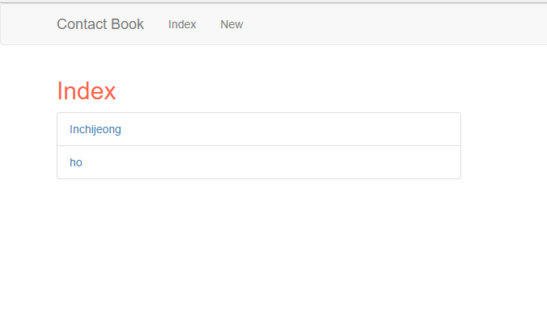
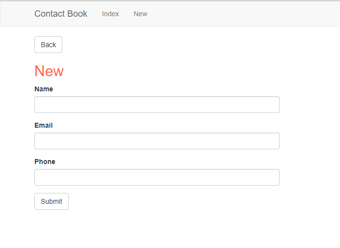
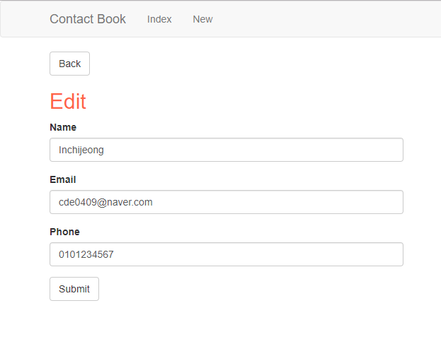
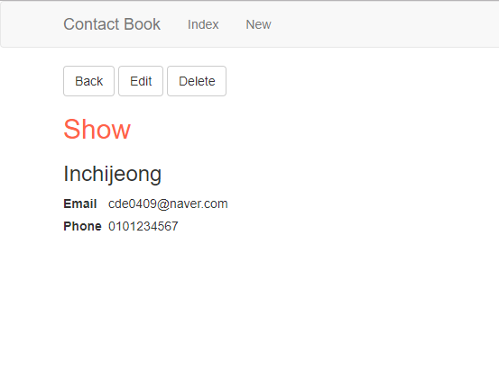
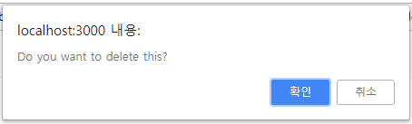

주소록 만들기
===

* 개발환경
  * node.js
  * express.js
  * MongoDB(mongoose)
  * ejs
  * bootstrap
* [A MEAN Blog](https://www.a-mean-blog.com/ko/blog/Node-JS-%EC%B2%AB%EA%B1%B8%EC%9D%8C/%EC%A3%BC%EC%86%8C%EB%A1%9D-%EB%A7%8C%EB%93%A4%EA%B8%B0 "A MEAN Blog")
 에 코드와 강의가 있습니다.

----

### 각 페이지 화면  

#### 1.Index

#### 2.New

#### 3.Edit

#### 4.Show

#### 5.Delete

